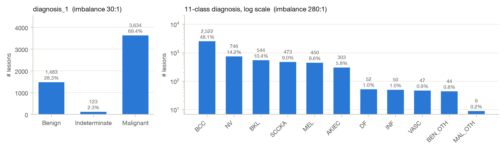
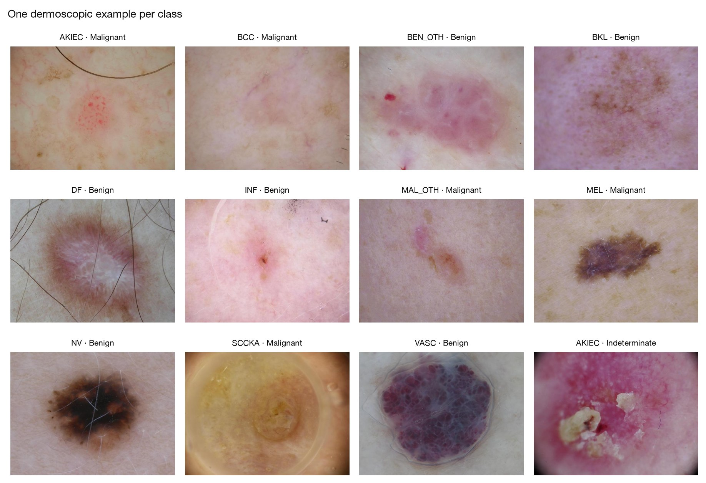

# Milestone 1 — label-centred EDA notes (B2)

The figures are produced by `python scripts/run_milestone1.py` (step B2). The metadata and colour analyses from
Session 2 are not repeated here; see the [Homework 1 report](../session2/Homework1_Report_George_Hanna.pdf).

## 1. Class distribution and the mapping between the two label schemes

Each 11-class label maps to exactly one `diagnosis_1` value, **except AKIEC**: 180 Malignant (squamous cell carcinoma in
situ) and 123 Indeterminate (actinic keratosis), and those 123 are all of the Indeterminate lesions. The full lesion
counts are in [`outputs/milestone1/class_to_diagnosis1.csv`](../../outputs/milestone1/class_to_diagnosis1.csv).

| diagnosis_1 | 11-class labels (lesions) |
|---|---|
| Malignant (3,634) | BCC 2,522 · SCCKA 473 · MEL 450 · AKIEC 180 · MAL_OTH 9 |
| Benign (1,483) | NV 746 · BKL 544 · DF 52 · INF 50 · VASC 47 · BEN_OTH 44 |
| Indeterminate (123) | AKIEC 123 |

## 2. Session 2 findings re-checked on the full dataset

| Session 2 finding | Still true on the full dataset? | Consequence for the pipeline |
|---|---|---|
| Age differs strongly by class (nevi come from young patients) | Yes: median age NV 40 vs. BCC 65, SCCKA 70 | Age is **not** an input of the image pipeline. Stratified splits keep the age mix similar. Check later that the model does not learn "young skin = benign". |
| Six columns leak the label (`diagnosis_2/3/4`, `melanocytic`, `diagnosis_confirm_type`, `concomitant_biopsy`) | Yes, by construction | Excluded from model inputs. The split CSVs carry only ids, image type and labels. |
| `image_manipulation = altered` is enriched in Indeterminate lesions | Yes: 12.8% vs. 2.0% Indeterminate | Possible acquisition shortcut: not an input; report metrics separately for altered images. |
| Colour alone separates Malignant from Benign only weakly (sample AUC ≤ 0.66) | Yes, on all 10,480 images: best single-feature AUC 0.67 | A CNN must learn spatial patterns. Colour augmentation stays mild (no hue jitter). |
| Dermoscopic images are much bluer than clinical ones (device effect > class effect) | Yes: mean B 137 (dermoscopic) vs. 106 (clinical) | Both images of a lesion go to the same split, so every split has both types in equal numbers. Evaluate per image type too. |
| A missing body site goes with more Benign lesions | Yes (34.5% vs. 28.3% Benign), and now explained: 3,850 of the 3,912 "missing" images are **trunk** lesions in `supplements/training_input.csv` | Missingness is not random. If site is used, recover "trunk" from the supplement and code the remaining 62 images as "unknown". |

Source table: [`outputs/milestone1/session2_findings_recheck.csv`](../../outputs/milestone1/session2_findings_recheck.csv).

## 3. Gallery: one example per class

## 4. Why MILK10k does not reflect real-world prevalence (biopsy enrichment)

MILK10k is not a sample of the skin lesions people have. It is a sample of the lesions that dermatologists chose
to investigate. 5,016 of the 5,240 lesions (95.7%) were confirmed by histopathology, so they were biopsied or
excised, and doctors biopsy what worries them. Only 224 lesions entered on a single clinician's assessment, and 87%
of those are benign. The result is a malignant share of 69% (BCC alone is 48%). In a general dermatology or
primary-care clinic, the large majority of lesions are harmless nevi and seborrhoeic keratoses that are never
biopsied. These lesions are under-represented here, and the benign lesions that *are* present are the atypical ones
that looked suspicious enough to remove: the hardest benign cases.

This changes how the final model's numbers must be read. First, accuracy is inflated by the class prior: always
answering "Malignant" already scores 69% on this data, and the same answer would be wrong for most lesions in a
real clinic. Second, predictive values and probabilities do not transfer. A positive predictive value measured where
69% of lesions are malignant will be much lower in a population with far fewer cancers, and the predicted
probabilities will be too high unless they are re-calibrated to the target prevalence. Third, the model learns to
separate lesions *given that they were referred for biopsy*. It has barely seen the ordinary moles that make up
daily practice, so its behaviour on them is unknown. I will therefore report balanced accuracy, macro-F1 and
per-class recall rather than accuracy. Results will be described as performance on biopsy-referred lesions, and any
claim about clinical use requires a new validation on consecutive, unselected patients.
